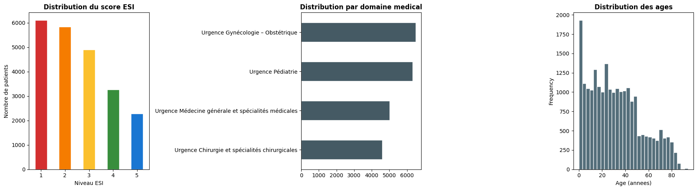
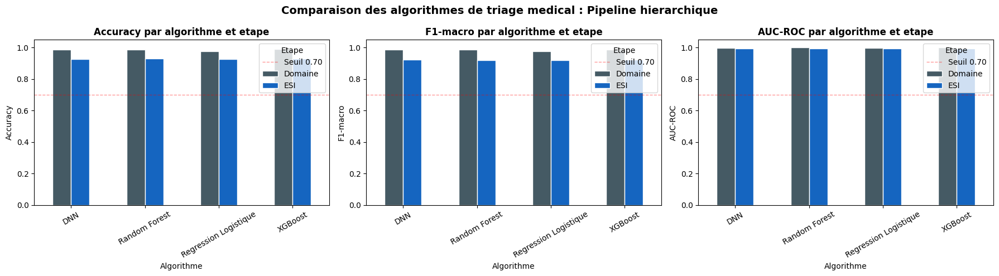
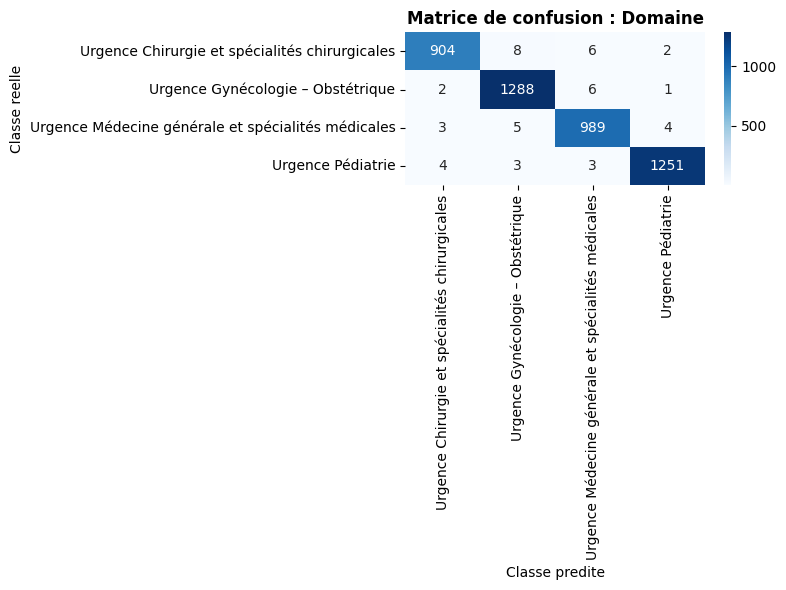
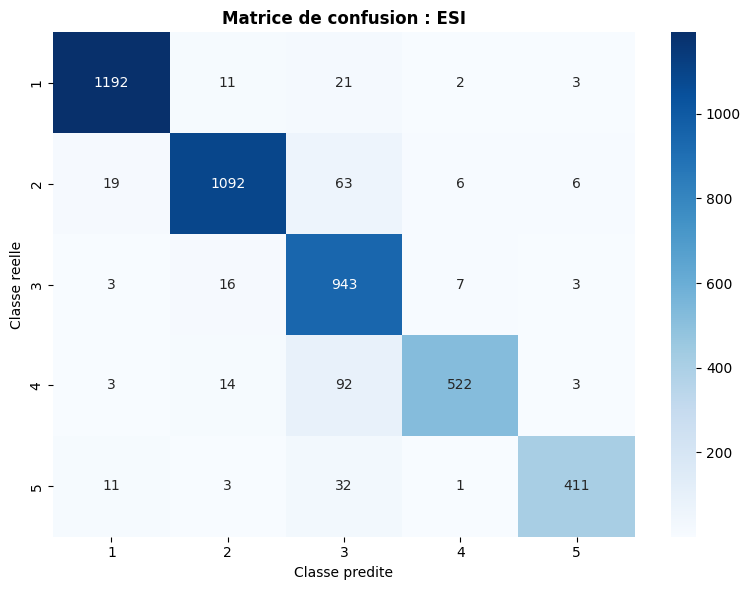

# Système intelligent d'aide à la décision pour le triage médical

**Conception et implémentation d'un pipeline de classification ESI par Machine Learning**
Cas de l'hôpital Diafra de Bobo-Dioulasso Burkina Faso

---

## Contexte

Le triage médical aux urgences consiste à classer les patients par ordre de priorité en fonction de la gravité de leur état clinique, afin d'optimiser la prise en charge et l'utilisation des ressources disponibles. Dans les services d'urgence à forte affluence, cette décision doit être prise rapidement et avec rigueur.

Ce projet développe un système intelligent capable d'analyser les données cliniques d'un patient à son arrivée aux urgences motif de consultation, examen clinique, constantes vitales, données démographiques et de proposer automatiquement une classification selon l' **Emergency Severity Index (ESI)** , échelle standardisée en cinq niveaux de gravité croissante.

### Les cinq niveaux ESI

| Niveau | Libellé         | Description                                                                       |
| ------ | ---------------- | --------------------------------------------------------------------------------- |
| ESI 1  | Réanimation     | Intervention immédiate requise, pronostic vital engagé                          |
| ESI 2  | Urgence critique | Risque d'aggravation rapide (ex. douleur thoracique, suspicion d'AVC)             |
| ESI 3  | Urgent           | Patient stable nécessitant plusieurs ressources diagnostiques ou thérapeutiques |
| ESI 4  | Semi-urgent      | Patient stable nécessitant une seule ressource                                   |
| ESI 5  | Non urgent       | Patient stable nécessitant peu ou pas de ressources                              |

---

## Architecture du pipeline

Le système repose sur une **prédiction hiérarchique en deux étapes** :

```
Données patient
(âge, sexe, lieu, motif de consultation, examen clinique)
        |
        v
Extraction des constantes vitales (regex)
+ Indicateurs d'alerte clinique (hypoxie, tachycardie, etc.)
        |
        v
   Étape 1 : Domaine médical  (4 spécialités)
        |  + probabilités domaine transmises en feature
        v
   Étape 2 : Score ESI  (niveaux 1 à 5)
```

À chaque étape, quatre algorithmes sont entraînés et comparés. Le meilleur selon le F1-macro est retenu pour enrichir l'étape suivante.

---

## Dataset

| Attribut           | Valeur                                                               |
| ------------------ | -------------------------------------------------------------------- |
| Source             | Dossiers patients, urgences du Burkina Faso                          |
| Patients           | 22 392                                                               |
| Colonnes           | `age`,`sexe`,`subject`,`object`,`ESI`,`Domaine`,`lieu` |
| Langues des textes | Français médical                                                   |
| Fichier            | `data/dataset_v4_triage_urgence.xlsx`                              |

**Distribution ESI :**

| ESI 1 | ESI 2 | ESI 3 | ESI 4 | ESI 5 |
| ----- | ----- | ----- | ----- | ----- |
| 6 113 | 5 829 | 4 905 | 3 258 | 2 287 |

**Domaines médicaux :**

| Domaine                                                  | Patients |
| -------------------------------------------------------- | -------- |
| Urgence Gynécologie – Obstétrique                     | 6 483    |
| Urgence Pédiatrie                                       | 6 307    |
| Urgence Médecine générale et spécialités médicales | 5 004    |
| Urgence Chirurgie et spécialités chirurgicales         | 4 598    |

**Profil démographique :** âge médian 29 ans, de 0 à 94 ans. Couverture géographique principale : province du Kadiogo (Ouagadougou), avec des admissions de Sanmatenga, Boulkiemdé, Houet, Gnagna et d'autres provinces.

### Visualisation du dataset



Les trois distributions révèlent plusieurs caractéristiques importantes du dataset :

**Distribution ESI (panneau gauche) :** la répartition est décroissante de ESI 1 à ESI 5, avec une prédominance des cas graves (ESI 1 : 6 113 patients, ESI 2 : 5 829). Ce profil est caractéristique des urgences hospitalières africaines à forte charge traumatologique et obstétricale, où les patients se présentent souvent à un stade avancé de la maladie. Les niveaux ESI 4 (3 258) et ESI 5 (2 287) sont moins représentés, ce qui génère un déséquilibre de classes que le paramètre `class_weight='balanced'` des modèles compense.

**Distribution par domaine médical (panneau central) :** les quatre domaines sont relativement équilibrés, avec une légère prédominance de la Gynécologie-Obstétrique (6 483) et de la Pédiatrie (6 307), reflet de la pyramide démographique burkinabè et de la forte mortalité maternelle et infanto-juvénile. Cette cohérence épidémiologique valide la représentativité du dataset.

**Distribution des âges (panneau droit) :** deux pics sont visibles un pic nourrisson/jeune enfant (0-5 ans) correspondant aux admissions pédiatriques, et une distribution adulte centrée autour de 20-40 ans avec une queue vers les personnes âgées. La médiane à 29 ans confirme la jeunesse de la population desservie.

---

## Algorithmes comparés

| Algorithme             | Type                      | Justification bibliographique                                                     |
| ---------------------- | ------------------------- | --------------------------------------------------------------------------------- |
| Régression Logistique | Linéaire                 | Modèle de référence clinique utilisé dans 53,1 % des études (Porto, 2024) |
| Random Forest          | Ensemble                  | Deuxième modèle le plus utilisé (46,6 %), AUC 0,92 (Levin et al., 2018)        |
| XGBoost                | Gradient boosting         | Meilleures performances dans la littérature récente                             |
| DNN                    | Réseau de neurones dense | Capture les relations non linéaires complexes entre features                     |

**Référence :** Porto et al. (2024).  *Systematic review of machine learning for emergency triage* . BMC Emergency Medicine. [DOI : 10.1186/s12873-024-01135-2](https://doi.org/10.1186/s12873-024-01135-2)

---

## Ingénierie des features

Le préprocesseur combine trois branches indépendantes via un `ColumnTransformer` scikit-learn, garantissant l'absence de fuite de données entre train et test :

**Branche numérique** 19 features

* Données démographiques : âge
* Constantes vitales extraites par regex depuis le texte de l'examen clinique : température, fréquence cardiaque, saturation en O2, fréquence respiratoire, tension artérielle systolique et diastolique, score de Glasgow
* Indicateurs d'alerte binaires : hypoxie (SpO2 < 94 %), saturation critique (< 90 %), fièvre (>= 38 °C), tachycardie (FC > 100), bradycardie (FC < 60), tachypnée (FR > 20), bradypnée (FR < 12), HTA, hypotension
* Longueurs textuelles : longueur totale, longueur du motif, longueur de l'examen

**Branche catégorielle** 2 features

* Sexe, province (lieu) encodées en one-hot

**Branche textuelle** TF-IDF bigrammes

* Texte clinique combiné (motif + examen), vocabulaire de 2 000 termes, `min_df=3`, lissage logarithmique (`sublinear_tf=True`)
* Les bigrammes capturent des expressions médicales composées : "douleur abdominale", "détresse respiratoire", "défense abdominale"

---

## Métriques d'évaluation

Trois métriques sont calculées pour chacun des 8 modèles (4 algorithmes × 2 étapes) :

| Métrique     | Justification                                                                                 |
| ------------- | --------------------------------------------------------------------------------------------- |
| Accuracy      | Proportion globale de prédictions correctes                                                  |
| F1-macro      | Moyenne non pondérée du F1 par classe pertinent pour les distributions déséquilibrées |
| AUC-ROC macro | Capacité discriminante multi-classe métrique de référence dans Porto (2024)            |

Le split train/test est stratifié sur le Domaine (ratio 80/20, `random_state=42`).

---

## Résultats

### Comparaison des algorithmes



Les trois graphiques présentent les performances des quatre algorithmes sur les deux étapes du pipeline (Domaine en gris foncé, ESI en bleu).

**Observations générales :** tous les modèles dépassent largement le seuil de 0,70 fixé comme référence clinique minimale. L'étape Domaine obtient systématiquement de meilleures métriques que l'étape ESI, ce qui est attendu : distinguer 4 grandes spécialités médicales est une tâche plus simple que discriminer 5 niveaux de gravité nuancés.

**DNN et Random Forest** dominent sur les trois métriques à l'étape ESI, avec une accuracy proche de 0,93 et une AUC-ROC proche de 1,0, confirmant leur capacité à capturer les relations non linéaires entre constantes vitales, texte clinique et niveau de gravité.

**XGBoost** présente des performances plus modestes à l'étape ESI sur l'accuracy (autour de 0,68), suggérant que les hyperparamètres choisis (learning_rate, max_depth) mériteraient une optimisation par Optuna pour ce dataset spécifique.

**Régression Logistique** maintient des performances solides et comparables à RF et DNN malgré sa simplicité, ce qui est cohérent avec la littérature (Porto, 2024) et justifie son statut de modèle de référence clinique.

### Matrice de confusion Étape 1 : Domaine médical



La classification du domaine médical atteint une accuracy globale de  **99,0 %** . Les quatre spécialités sont distinguées avec une très haute précision :

| Domaine                                                  | Recall |
| -------------------------------------------------------- | ------ |
| Urgence Chirurgie et spécialités chirurgicales         | 98,3 % |
| Urgence Gynécologie – Obstétrique                     | 99,3 % |
| Urgence Médecine générale et spécialités médicales | 98,8 % |
| Urgence Pédiatrie                                       | 99,2 % |

Les rares erreurs (au maximum 8 cas par cellule hors-diagonale) sont cliniquement compréhensibles : un patient pédiatrique avec pathologie chirurgicale ou une femme enceinte avec complication médicale peuvent générer des ambiguïtés de domaine. Ces probabilités de domaine, transmises comme features à l'étape 2, apportent un contexte spécialisé qui améliore la classification ESI.

### Matrice de confusion Étape 2 : Score ESI



La classification ESI atteint une accuracy globale de  **92,9 %** . Le recall par niveau révèle un gradient cliniquement cohérent :

| Niveau ESI | Recall | Interprétation                                                                  |
| ---------- | ------ | -------------------------------------------------------------------------------- |
| ESI 1      | 97,0 % | Cas critiques très bien identifiés priorité vitale correctement détectée |
| ESI 2      | 92,1 % | Urgences critiques bien classées malgré leur hétérogénéité clinique       |
| ESI 3      | 97,0 % | Cas urgents stables très bien reconnus                                          |
| ESI 4      | 82,3 % | Principale zone de confusion : 92 patients ESI 4 classés ESI 3                  |
| ESI 5      | 89,7 % | 32 patients ESI 5 classés ESI 3                                                 |

**Analyse des erreurs :** la confusion principale est la surestimation de la gravité (ESI 4 prédit comme ESI 3, ESI 5 prédit comme ESI 3). Dans un contexte d'aide à la décision clinique, cette erreur est acceptable voire préférable car elle conduit à prendre en charge un patient semi-urgent comme urgent, plutôt que l'inverse. La sous-estimation de la gravité (ESI 1 classé comme ESI 2 : 11 cas) reste très limitée et représente le risque clinique à surveiller en production.

---

## Structure du projet

```
triage_medical/
├── data/
│   └── dataset_v4_triage_urgence.xlsx     # Dataset principal (22 392 patients)
├── notebooks/
│   ├── triage_esi_comparaison_algorithmes.ipynb   # Pipeline principal (ce projet)
│   └── prediction_hierarchique_admission.ipynb    # Version de référence initiale
├── modeles/                               # Généré après exécution du notebook
│   ├── preprocesseur.pkl
│   ├── label_encoder_domaine.pkl
│   ├── label_encoder_esi.pkl
│   ├── best_domaine.pkl  (ou .keras si DNN)
│   ├── best_esi.pkl      (ou .keras si DNN)
│   └── config.pkl
└── README.md
```

---

## Installation

### Prérequis

Python 3.9 ou supérieur.

```bash
pip install pandas numpy scikit-learn xgboost tensorflow openpyxl seaborn matplotlib joblib scipy
```

### Lancer le notebook

```bash
jupyter notebook notebooks/triage_esi_comparaison_algorithmes.ipynb
```

Exécuter les cellules dans l'ordre. Le chemin vers le dataset est défini en section 3 :

```python
DATA_PATH = 'data/dataset_v4_triage_urgence.xlsx'
```

---

## Utilisation en inférence

Après exécution complète du notebook, la fonction `predire_patient` permet de classifier un nouveau patient sans réentraîner les modèles :

```python
resultat = predire_patient(
    age=58,
    sexe='Masculin',
    lieu='Kadiogo',
    motif_consultation='douleurs thoraciques intenses irradiant dans le bras gauche, dyspnée',
    examen_clinique='TA 185/110 mmHg, FC 102 bpm, SpO2 91%, FR 26/min, GCS 14/15',
)

print(f"Domaine prédit : {resultat['domaine']}")
print(f"ESI prédit     : {resultat['esi']}")
print(resultat['top_domaines'])
```

La fonction extrait automatiquement les constantes vitales du texte d'examen clinique, calcule les indicateurs d'alerte, et applique la chaîne Domaine → ESI sans aucune configuration supplémentaire.

---

## Pistes d'amélioration

**Équilibrage des classes** : appliquer SMOTE ou ADASYN sur les niveaux ESI sous-représentés (ESI 4 et 5).

**Optimisation des hyperparamètres** : utiliser Optuna pour XGBoost et la taille du vocabulaire TF-IDF.

**Encodage textuel avancé** : remplacer TF-IDF par CamemBERT (modèle BERT en français) pour distinguer des négations médicales comme "pas de douleur" vs "douleur".

**Calibration des probabilités** : appliquer `CalibratedClassifierCV` pour des scores de confiance interprétables cliniquement.

**Déploiement** : exposer `predire_patient` via une API FastAPI et intégrer SHAP pour l'explicabilité des prédictions (traçabilité clinique).

---

## Références

Porto et al. (2024).  *Artificial intelligence in emergency triage: a systematic review of machine learning applications* . BMC Emergency Medicine, 24(1). [https://doi.org/10.1186/s12873-024-01135-2](https://doi.org/10.1186/s12873-024-01135-2)

Levin S. et al. (2018).  *Machine-learning-based electronic triage more accurately differentiates patients with respect to clinical outcomes compared with the emergency severity index* . Annals of Emergency Medicine.

Kim J. et al. (2021).  *Validation of triage by BERT-based natural language processing using Korean triage and acuity scale* . JAMIA Open.

---

